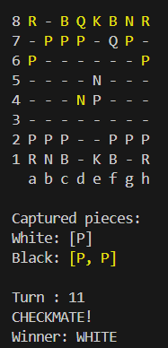

# Jogo de Xadrez em Java

Bem-vindo ao Chess Game, um projeto desenvolvido em Java que simula um jogo de xadrez completo no terminal. Este projeto foi criado com uma arquitetura modular e orientada a objetos para facilitar o entendimento e a manutenção.

> Este projeto faz parte do **Curso de Java** ministrado pelo professor **Nélio Alves**.

## 🚀 Funcionalidades

- Jogabilidade completa de xadrez.
- Validação de movimentos seguindo as regras oficiais do xadrez.
- Tratamento de exceções para movimentos inválidos.
- Interface simplificada no terminal.

## 🔧 Tecnologias Utilizadas

- **Java SE 23**: Linguagem de programação.
- **Programação orientada a Objetos**
- **Tratamento de Exceções**: Para maior robustez do código.

## 🧩 Estrutura do Projeto

O projeto está organizado nos seguintes pacotes e classes:

### **Pacote `application`**
- **`Program.java`**: Classe principal que inicializa o jogo e interage com o usuário.
- **`UI.java`**: Responsável pela interface no terminal, exibindo o tabuleiro e mensagens.

### **Pacote `boardgame`**
- **`Board.java`**: Representa o tabuleiro e gerencia as peças e posições.
- **`BoardException.java`**: Classe para tratamento de exceções relacionadas ao tabuleiro.
- **`Piece.java`**: Classe genérica para todas as peças no tabuleiro.
- **`Position.java`**: Representa uma posição no tabuleiro.

### **Pacote `chess`**
- **`ChessException.java`**: Classe para tratamento de exceções específicas do jogo de xadrez.
- **`ChessMatch.java`**: Gerencia a lógica da partida de xadrez.
- **`ChessPiece.java`**: Representa uma peça específica de xadrez (ex.: rei, rainha).
- **`ChessPosition.java`**: Mapeia posições do tabuleiro de xadrez no formato oficial (ex.: `e2`).
- **`Color.java`**: Enum para definir as cores das peças (`WHITE`, `BLACK`).

### **Pacote `chess.pieces`**
- Contém as implementações específicas de cada tipo de peça (ex.: Rei, Rainha, Cavalo, Torre).

## 🖼️ Demonstração

